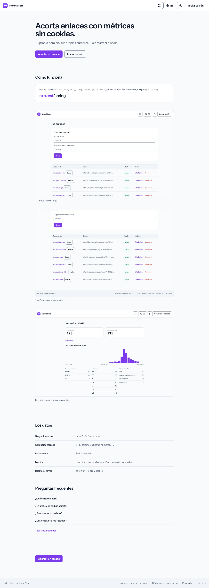
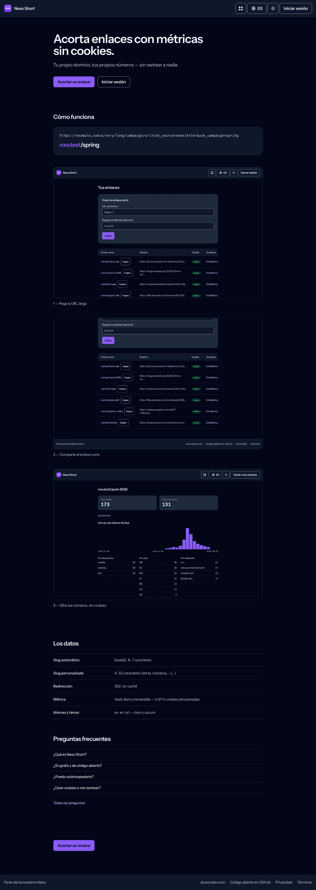

# Nexo Short

**Short links on your own domain — the open-source URL shortener of the Nexo ecosystem (a self-hosted Bitly / Dub alternative).**
Cookieless click metrics, anti-abuse built in, no raw IPs.

[**Live demo**](https://nexoshort.alvarocdev.com) ·
[Deployment guide](DEPLOYMENT.md) ·
[Architecture](docs/ARCHITECTURE.md) ·
[Scope](docs/SCOPE.md)

---

Nexo Short is a **self-hosted URL shortener** — a Bitly / Dub alternative you run on
**your own domain** — with cookieless click metrics and privacy by design. It's part
of the **Nexo** family, so it ships the shared Nexo chrome and the optional single
account ([Nexo ID](https://github.com/nexo-tools/nexo-id) SSO). It is **live in
production**: redirects on **nxo.li**, panel on
**[nexoshort.alvarocdev.com](https://nexoshort.alvarocdev.com)**.

## Why Nexo Short?

- **Your own domain, no lock-in** — short links live on a domain *you* control (e.g.
  `nxo.li`), not a shared branded host. No platform can paywall or reclaim them.
- **Cookieless click metrics** — per-link click totals and stats with **zero cookies
  and no raw IPs stored**. No consent banner needed.
- **Anti-abuse built in** — optional Google Safe Browsing checks on new links, an
  anonymous report system (malicious / spam / abusive / broken) with moderation, and
  per-user and per-IP rate limits on link creation.
- **Split-host by design** — a **cookieless redirect host** (fast, sessionless) is kept
  separate from the **panel host** (SEO landing, auth and dashboard), each with its own
  `robots` policy so only the right surface is indexed.
- **Flexible auth** — standalone local accounts out of the box, or **SSO-only** via
  Nexo ID; registration can be open or closed by env (self-host opens it; the hosted
  instance keeps it closed).
- **Private and fast** — server-rendered redirects, **zero external requests** at
  runtime (no CDNs, no font services, no trackers).
- **Multilingual** — English, Spanish and Portuguese (`en`/`es`/`pt`) with a visible
  switcher and a translatable `/help` center.
- **Self-hostable** — a standard Laravel app; run the whole shortener on your own
  infrastructure.

## Screenshots

Captured from a local instance seeded with `DemoSeeder`, by
`node ~/alvaro/scripts/nexo-shots.mjs .` — never from production.

| Light | Dark |
| --- | --- |
|  |  |

See it for real at the [live demo](https://nexoshort.alvarocdev.com).

## Tech stack

PHP 8.3+ · Laravel 13 · Blade + Alpine.js + Tailwind CSS (Vite) · MySQL

Nexo ID id_token verification with
[firebase/php-jwt](https://github.com/firebase/php-jwt). Quality:
[Pest](https://pestphp.com) · [Pint](https://laravel.com/docs/pint) ·
[Larastan](https://github.com/larastan/larastan) · GitHub Actions CI.
Zero external runtime requests — system font stack, no CDNs.

## Self-hosting

A standard Laravel app: PHP 8.3+, MySQL, and anything from cheap shared hosting to a
VPS. Multi-instance by design — short links on a domain *you* control, not a shared
branded host. The redirect host and the panel host are separate by design, and both
are covered in the guide.

**[DEPLOYMENT.md](DEPLOYMENT.md)** has the real steps: running it locally, the
environment reference (attribution, Nexo ID SSO, Safe Browsing, rate limits) and the
production deploy.

## Documentation

- [Scope](docs/SCOPE.md) · [Architecture](docs/ARCHITECTURE.md)
- Specs: [phase 1 — core](docs/SPEC-phase-1-core.md) · [phase 2 — metrics](docs/SPEC-phase-2-metrics.md) · [phase 3 — anti-abuse](docs/SPEC-phase-3-anti-abuse.md)
- [Plan & gates](docs/PLAN.md) · [Decisions (ADRs)](docs/adr/)
- [Deployment guide](DEPLOYMENT.md)

## Nexo ecosystem

Nexo is a family of open-source, self-hostable tools that share one visual identity,
one optional account ([Nexo ID](https://github.com/nexo-tools/nexo-id) SSO) and one set of
engineering standards. Every tool runs **fully standalone** — the ecosystem is opt-in.

| Tool | What it is | Live | Repo |
| --- | --- | --- | --- |
| **Nexo Tools** | Ecosystem hub — discover the tools and hop between them with one account | [nexotools.alvarocdev.com](https://nexotools.alvarocdev.com) | [nexo-tools](https://github.com/nexo-tools/nexo-tools) |
| **Nexo ID** | One account for every tool — OAuth 2.0 / OIDC SSO | [nexoid.alvarocdev.com](https://nexoid.alvarocdev.com) | [nexo-id](https://github.com/nexo-tools/nexo-id) |
| **Nexo Links** | Link-in-bio you host yourself (Linktree alternative) | [nexolinks.alvarocdev.com](https://nexolinks.alvarocdev.com) | [nexo-links](https://github.com/nexo-tools/nexo-links) |
| **Nexo Agenda** | Bookings for service businesses (Fresha / Booksy alternative) | [nexoagenda.alvarocdev.com](https://nexoagenda.alvarocdev.com) | [nexo-agenda](https://github.com/nexo-tools/nexo-agenda) |
| **Nexo Short** | URL shortener with private, cookieless stats | [nexoshort.alvarocdev.com](https://nexoshort.alvarocdev.com) | — you are here |
| **Nexo Events** | Event tickets, passes and QR check-in | [nexoevents.alvarocdev.com](https://nexoevents.alvarocdev.com) | [nexo-events](https://github.com/nexo-tools/nexo-events) |

New to Nexo? Start at **[nexotools.alvarocdev.com](https://nexotools.alvarocdev.com)**.
Built by **[alvarocdev.com](https://alvarocdev.com)** — the tech behind Nexo.

## License

[MIT](LICENSE) © [Alvaro Carrizales](https://alvarocdev.com) — the tech behind Nexo.

---

Status: **live** — redirects on [nxo.li](https://nxo.li), panel at
[nexoshort.alvarocdev.com](https://nexoshort.alvarocdev.com), signing in through Nexo ID.
